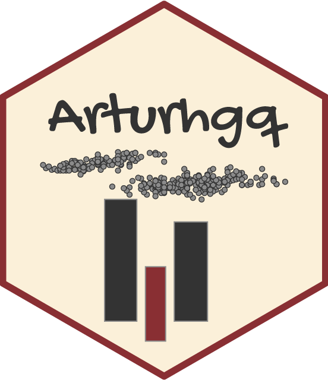

{width=30%}

Há algum tempo venho acumulando material que dificilmente será aproveitado em artigos científicos. Tutoriais sobre técnicas de manipulação, análise e visualização de dados, por exemplo. O site foi concebido para dar vazão a esse tipo de conteúdo, mas não se limitará a ele. Também produzirei análises políticas de questões relevantes para o contexto atual. Escreverei, entre outras coisas, sobre:

  1. partidos políticos, em duas de suas dimensões, a eleitoral-representativa e a governativa; e
  2. fenômenos que estão associados ou explicam a qualidade da democracia no século XXI.

O site foi construído via `blogdown` e `Hugo`.  Ele está hospedado na plataforma `netlify` e é alimentado por um repositório no `github`^[Todo o conteúdo do site é replicável e está disponível em meu github.]. `Blogdown` é uma uma biblioteca em `R` para a construção de _websites_ e `Hugo` é um gerador de páginas estáticas em `HTML`. 

